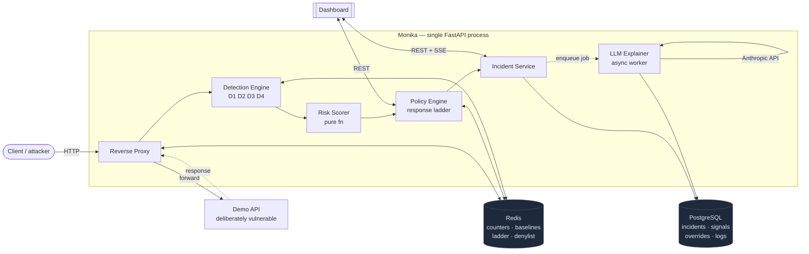
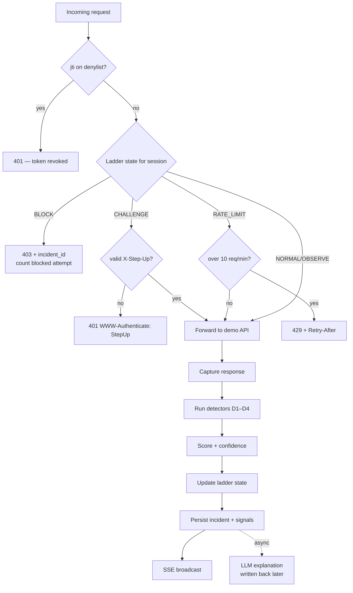
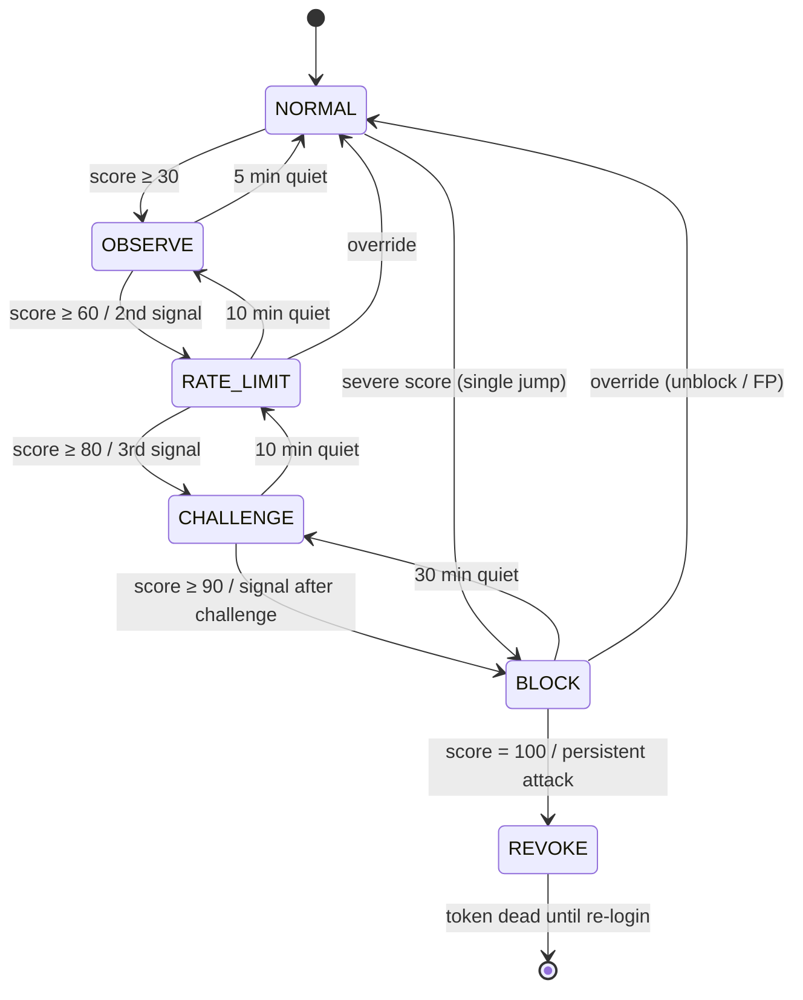

# Monika — an adaptive API security gateway

## [**🔗 Live demo: monika.gdgmpstme.com**](https://monika.gdgmpstme.com)

A FastAPI reverse proxy sits in front of a deliberately vulnerable demo API, captures every request+response, and runs four deterministic detectors (auth/BOLA, enumeration, rate/behavior, payload/exposure). Signals become a 0–100 risk score, which drives a per-session response ladder: `NORMAL → OBSERVE → RATE_LIMIT → CHALLENGE → BLOCK → REVOKE`. A dashboard shows every incident with its evidence, lets an analyst override, and displays an LLM-written explanation that arrives *after* the decision was enforced.

The point Monika makes: **the engine decides with numbers and evidence; the language model only explains, after the fact.** Confidence, scores, and enforcement are all computed by deterministic code you can read and test. The LLM never votes.

---

## 1. Architecture

Monika is a single FastAPI process built from six modules with strict one-way dependencies. A request flows down the chain; nothing lower ever imports something higher, and the explainer hangs off the side asynchronously.

```
proxy → detection → scoring → policy → incidents ⇢ explainer
```

- **Redis** holds all hot state: per-session counters, learned endpoint baselines, ladder state, and the JWT denylist. It is authoritative for the enforcement path.
- **PostgreSQL** is the system of record for everything the dashboard reads: incidents, signals, overrides, request log, sessions.
- The **dashboard** is a separate app that talks to Monika over REST plus one Server-Sent-Events stream. It never polls.

| Module | Owns | Must never |
|---|---|---|
| **Reverse proxy** | Request/response capture, forwarding to the demo API, applying the current ladder action, JWT parsing (no business-claim verification) | Contain detection logic |
| **Detection engine** | Running detectors, emitting typed `Signal` objects with evidence | Decide actions or write to Postgres directly |
| **Risk scorer** | Pure function: signals + session history → integer score | Have side effects |
| **Policy engine** | Ladder state per session, escalation/decay, override application, denylist | Call the LLM |
| **Incident service** | Creating/updating incidents, persisting signals, SSE broadcast, override API | Block requests |
| **LLM explainer** | Async worker: evidence JSON → prose, written back onto the incident | Emit numbers, change state, or run in the request path |



### The request pipeline

The proxy **enforces the session's current ladder state before forwarding, then forwards, then detects** on the full request+response pair. Enforcement is therefore always *one request behind* detection. This is deliberate (see Trade-offs): detectors D1 and D4 need the response body, so detection cannot run before the upstream call without doubling latency.

The one exception is **REVOKE**: a revoked token's `jti` is on a Redis denylist that is checked *before* any forwarding, so a killed credential is dead immediately.



---

## 2. Detection strategy

Four detectors, all deterministic, each emitting typed `Signal` objects carrying a fixed **evidence** dictionary that the dashboard renders verbatim. A signal without evidence is a bug. These are the real thresholds, not "heuristics".

### D1 — Authorization (BOLA · broken auth · function-level auth)

Runs only on endpoints flagged `auth_required`. Three rules, all category `auth`:

| Rule | Fires when | Severity |
|---|---|---|
| **BOLA owner mismatch** | An authenticated 200 returns an object whose owner ≠ requester, and the requester is not an admin | **70**; **85** if a configured sensitive field is present in the body; **95** if the session already produced ≥3 auth signals in the last 5 min |
| **Broken authentication** | An `auth_required` endpoint returns 200 with no/invalid token | **60** |
| **Function-level auth** | An `admin_only` endpoint returns 200 to a `sub` not in the admin allow-list | **70** |

The 95 escalation reads `auth_signals:{session_key}:{minute}` (INT, TTL 300s) across a 5-minute window; D1 increments it for every auth signal it emits. D1 also records the owner values it sees so D2 can count distinct owners without importing D1.

### D2 — Enumeration

Category `enum`. Tracks the object IDs a session requests against one endpoint (Redis ZSET, 60s window). Fires when **≥5 distinct IDs in 60s AND** the pattern looks like a sweep — **either a monotonic run of ≥4 consecutive IDs, or access spanning ≥3 distinct owners**. Repeated reads of the same ID don't count.

Severity scales with breadth: `min(90, 50 + 5 × (distinct_ids − 5))`.

### D3 — Rate / Behavior

Category `rate`. Two rules:

| Rule | Fires when | Severity |
|---|---|---|
| **Rate anomaly** | Session's per-minute rate for an endpoint has **z ≥ 3** vs the learned baseline **OR** `rpm ≥ 5 × mean` — but **never below the absolute floor of 20 rpm** | Linear from **40** at z=3 to **85** at z=10; **+10** on `/api/login` |
| **Credential stuffing** | On `POST /api/login`: **≥8 failed (401) responses in 60s** from one session, **OR ≥5 distinct usernames from one IP in 60s** | **75** |

The 20-rpm floor is the single most important precision guard: it stops a low-traffic endpoint (mean 0.4 rpm) from firing at 3 rpm and drowning the dashboard in false positives.

### D4 — Payload / Exposure

Two independent sub-rules emitting two **distinct** categories (kept distinct so they can correlate):

**Injection** (category `payload`) — a curated, *anchored* pattern set applied to query values, path segments, and every JSON string in the body (keys included, to catch NoSQL operators like `{"$ne": ...}`):

| Pattern family | Example |
|---|---|
| `sql_tautology` | `' OR '1'='1` |
| `union_select` | `x' UNION SELECT username FROM users` |
| `sql_comment` | `admin'--` |
| `stacked_query` | `1; DROP TABLE users` |
| `nosql_operator` | `{"$ne": ""}` |
| `template_command` | `{{7*7}}`, `$(whoami)` |

Anchoring means ordinary prose does not trip it — "select the premium plan or size large" is safe. Severity **60**; **80** when the response is 200 and its size exceeds 3× the endpoint's baseline bytes.

**Exposure** (category `exposure`) — this is the honest signal for excessive data exposure: a *scrape or bulk dump*, not a single legitimate read. Fires when a configured sensitive field appears as a key in a 200 response **AND** any of:

- the body is a **bulk list of >20 items** → severity **85**, or
- the response is **abnormally large (>3× baseline bytes)** → severity **70**, or
- the session has read **more than 8 distinct resources** (path params + query, e.g. `?page=N`) of this sensitive endpoint **within a 30s window** → severity **70**.

The breadth rule is what separates a paged catalogue scrape from benign browsing: a scrape covers the catalogue in seconds; benign browsing reaches the same pages spread over minutes, so few fall inside the window, and re-reading one page never counts.

### OWASP API Top-10 coverage map

| OWASP API risk | Detectors | Demo scenario |
|---|---|---|
| **API1** Broken Object Level Authorization | D1 + D2 + correlation | IDOR sweep |
| **API2** Broken Authentication | D1 (no-token 200) + D3 stuffing rule | Credential stuffing |
| **API3** Excessive Data Exposure | D4 exposure | Product scrape exposing `cost_price` |
| **API4** Lack of Resources & Rate Limiting | D3 | Burst scrape |
| **API5** Broken Function Level Authorization | D1 (admin endpoint) | Non-admin hits `/api/admin/users` |
| **API8** Injection | D4 injection | SQLi on `/api/search` |

**Knowingly uncovered:** `POST /api/transfer` has no detector (see Trade-offs). This is a deliberate, stated gap.

---

## 3. Risk scoring

Signals within one request are grouped by category. The score is the **maximum category severity**, plus a **bounded correlation bonus**, plus a **bounded session-history term** — capped at 100.

```python
def score(signals, session) -> int:
    if not signals:
        return 0
    by_cat = {s.category: max(x.severity for x in signals if x.category == s.category)
              for s in signals}
    base = max(by_cat.values())
    corr_bonus = {1: 0, 2: 10, 3: 18, 4: 25, 5: 25}[len(by_cat)]
    hist = min(10, 2 * session.signals_last_5m)
    return min(100, base + corr_bonus + hist)
```

**Why max-severity-plus-correlation and not an additive sum.** One real attack usually trips several detectors at once — an IDOR sweep fires D1 *and* D2 *and* D3 on the same request. A plain point-sum would double-count that single attack and let severity run away, so a benign burst that happens to touch two detectors could outscore a genuine breach. Taking the *maximum* category severity as the base means the score reflects the single most serious thing observed; the correlation bonus then rewards *breadth of evidence* (distinct attack categories co-firing) in a bounded way, and the history term adds a small, capped nudge for a session that keeps misbehaving. The result is a number that is defensible to a judge: it can only reach 100 when a severe signal is corroborated by other categories and prior activity — never by arithmetic accident.

### Worked example — BOLA sweep, 4th request

| Signal | Severity | Note |
|---|---|---|
| auth (D1) | 85 | owner mismatch + sensitive field in response |
| enum (D2) | 60 | 6 IDs in 60s, run of 6 |
| rate (D3) | ~55 | z ≈ 5.1 |
| **base = max** | **85** | |
| **correlation bonus** (3 categories) | **+18** | |
| **history** (3 prior signals) | **+6** | |
| **Total** | **100** (capped from 109) | → SEVERE → BLOCK; REVOKE because score = 100 |

Score bands: `0–29` safe (no incident) · `30–59` suspicious · `60–79` high · `80–89` critical · `90–100` severe.

**Confidence** is computed the same deterministic way and is never sourced from the model:

```
confidence = min(99, 40 + 15 × distinct_categories + 5 × min(prior_signals_5m, 4) + 10 × [any z_score ≥ 5])
```

---

## 4. The response ladder

Each `session_key` has exactly one ladder state. Escalation is triggered by score bands or signal repetition; decay is time-based on clean traffic. The transition table is encoded as **data** (so tests iterate every row), not a chain of ifs.

| From | To | Trigger | Enforcement |
|---|---|---|---|
| NORMAL | OBSERVE | score ≥ 30 | Verbose logging; no user impact |
| OBSERVE | RATE_LIMIT | score ≥ 60 OR 2nd signal within 5 min | 10 req/min per session; excess → 429 with `Retry-After` |
| RATE_LIMIT | CHALLENGE | score ≥ 80 OR 3rd signal within 5 min | 401 with `WWW-Authenticate: StepUp`; passes only with a fresh `X-Step-Up` token |
| CHALLENGE | BLOCK | score ≥ 90 OR any signal after a passed challenge | 403 for all requests; body includes `incident_id` |
| BLOCK | REVOKE | score = 100 OR sustained attack while BLOCKED | `jti` added to denylist; token dead until re-login; new session starts at OBSERVE |
| OBSERVE | NORMAL | 5 min without signals | — |
| RATE_LIMIT | OBSERVE | 10 min without signals | — |
| CHALLENGE | RATE_LIMIT | 10 min without signals | — |
| BLOCK | CHALLENGE | 30 min without signals | — |
| any | NORMAL | Override: unblock / false_positive | Incident → overridden; session cleared |
| any | BLOCK | Override: force_block | Incident created with `source=analyst` |

### Escalation rule

The spec only lists adjacent-rung edges, but the design requires reaching BLOCK within three requests of a severe attack. The binding rule is:

> **`new_state = max(current_state, band_floor(score), signal_floor)` by ladder ordinal, applied as at most one transition per request.** A single high score can jump multiple rungs in one step (e.g. NORMAL → BLOCK at score 100). Decay moves exactly one rung down. REVOKE is reachable only from BLOCK.
>
> Band floors: `≥30` OBSERVE · `≥60` RATE_LIMIT · `≥80` CHALLENGE · `≥90` BLOCK · `=100` (or an auth/exposure signal while already BLOCK) REVOKE.

Two refinements keep the ladder honest during a real sweep:

- **Correlation-first:** a request whose signals span **fewer than 2 distinct categories** and whose score is **< 90** escalates at most to RATE_LIMIT. CHALLENGE/BLOCK 401/403 pre-forward would *freeze detection*, so a lone moderate signal throttles rather than slamming the door before the attack pattern can form. A single signal ≥90 is unaffected.
- **Persistence → REVOKE:** a BLOCKed session is 403'd pre-forward, so no new signal can be produced. A session that keeps sending authenticated requests while blocked is revoked after 3 blocked attempts, reusing the revoke path (denylist the `jti`, reset the ladder to OBSERVE/0).



---

## 5. Trade-offs (stated honestly)

- **Enforcement is one request behind detection.** Detectors D1 (owner mismatch) and D4 (exposure) need the *response body*, which only exists after the upstream call. Inspecting it inline before forwarding would double latency, so Monika enforces the current ladder state on the *next* request instead. The attacker gets at most one extra response before the ladder tightens. REVOKE is the exception — the `jti` denylist is checked pre-forward, so a killed token never gets even one more response.
- **Baselines are seeded, not continuously learned.** A ~3-minute benign learning phase (`seed_baselines.py`) fills the per-endpoint rate/byte baselines on startup, and they are frozen for the demo. This makes runs repeatable and keeps D3 from drifting mid-demo; the cost is that a genuine change in traffic shape would need a re-seed rather than adapting online.
- **The LLM is off the decision path entirely.** The explainer is the only module allowed to call the Anthropic API. It runs asynchronously *after* the incident is persisted and enforced, produces prose only, and never emits a number, score, confidence, or action. If the API is slow or absent, the incident is fully detected, scored, and enforced anyway — the explanation slot just shows "unavailable" (with an optional cached fallback for the IDOR incident).
- **`POST /api/transfer` is knowingly uncovered.** It stays in the demo API as an unmonitored vulnerable route (the demo API must stay vulnerable), but no detector watches it. A stated coverage gap is defensible; a silent one is not.

---

## 6. How to run

### 6.1 Prerequisites

- **Docker Desktop** (with Compose v2) for the one-command path — this is the recommended way to run everything.
- For the no-Docker path instead: **Python 3.12** + [`uv`](https://docs.astral.sh/uv/), **Node 20+** + `pnpm`, and a local **Postgres 16** + **Redis 7**.
- A few GB of free disk — the dashboard's Docker build alone pulls several hundred MB of `node_modules`.

### 6.2 One-time setup

```bash
git clone <repo-url> monika && cd monika
cp .env.example .env
```

The defaults in `.env` work as-is for the Docker path. The one field worth filling in is `MONIKA_ANTHROPIC_API_KEY` — leave it blank and the app still works fully (detection, scoring, enforcement, the dashboard), the LLM explanation panel just shows "unavailable" (rule: the LLM never decides, so nothing else depends on it).

### 6.3 Run the full stack (Docker — recommended)

```bash
make up
```

This builds and starts, in dependency order: `postgres`, `redis`, `migrate` (one-shot Alembic), `demo-api` + `seed` (one-shot: creates demo users/orders/products), `monika`, `dashboard`, `seed-baselines` (one-shot: ~3-minute benign learning phase), and `traffic-gen` (continuous benign background traffic).

Tail the learning phase and wait for it to finish before doing anything else:

```bash
make logs s=seed-baselines
```

Wait for `learning phase complete`. Baselines aren't populated before that, so D3 (rate) and D4 (exposure) can misbehave on a cold stack.

Once that's printed, open the dashboard:

```
http://localhost:3000
```

### 6.4 Run an attack scenario

```bash
make demo s=idor        # idor | stuffing | sqli | scrape | admin | benign
```

Watch the dashboard's **Incidents** page — the scenario's incident should appear within a few seconds (see the scenario table further down for what each one should trigger).

### 6.5 Fast-forward the ladder for a live demo

```bash
make fastmode
```

Rebuilds and restarts just the `monika` service with `MONIKA_LADDER_TIME_DIVISOR=10`, so ladder decay (NORMAL ⇄ OBSERVE ⇄ ... timers) plays out in seconds instead of minutes. Use this before a live walkthrough; skip it for anything you want to behave at realistic real-world timing.

### 6.6 Reset between demo runs

```bash
make reset
```

Truncates `incident`/`signal`/`request_log`/`session`/`attack_plan`, flushes **all** Redis state, and re-runs the 3-minute learning phase from scratch. `override` rows are never deleted (rule 6), and any incident or session they still reference survives the reset intact. **Run this before every rehearsal.** Baselines and detector counters drift across ad-hoc restarts — a stale baseline from an earlier session is the most common cause of a detector misfiring on traffic that looks completely normal (see Troubleshooting below).

### 6.7 Tests and lint

```bash
make test        # backend unit tests — just needs `uv sync`, no Docker
make test-int    # real-stack scenario tests — requires `make up` to be running
make lint        # ruff + mypy (backend); eslint + next build + tsc --noEmit (frontend)
make lint-arch   # import-linter: enforces the one-way module dependency rules (§1)
make types       # export monika's OpenAPI schema and regenerate dashboard/lib/types.gen.ts
```

`make test-int` drives every attack scenario through the real proxy + real demo API (never mocked) and asserts the expected `threat_type` and minimum score from the scenario table further down, plus that benign traffic alone never produces an incident ≥ 30.

`make types` needs no running stack — it builds the FastAPI app in-process just to introspect its schema (`monika/export_openapi.py`), then runs `openapi-typescript` on it. `dashboard/lib/types.ts` is still hand-maintained (kept in sync by hand against the generated file) rather than a thin re-export of it, so this is a drift check as much as codegen: if `types.gen.ts` disagrees with `types.ts` after a backend model change, `types.ts` needs updating.

### 6.8 Running without Docker (local dev)

**Backend:**

```bash
cd monika
uv sync
# point MONIKA_DATABASE_URL / MONIKA_REDIS_URL in .env at your own Postgres/Redis first
uv run alembic upgrade head
uv run uvicorn app.main:app --reload --port 8000
```

**Frontend:**

```bash
cd dashboard
pnpm install
NEXT_PUBLIC_MONIKA_URL=http://localhost:8000 pnpm dev
```

Open `http://localhost:3000`. To work on the UI with no backend at all, use static fixtures instead: `NEXT_PUBLIC_USE_FIXTURES=1 pnpm dev`.

### 6.9 Stopping and cleaning up

```bash
make down        # stop every container and remove the postgres volume
```

### Troubleshooting

- **Dashboard shows no data / CORS errors in the browser console** — check `MONIKA_CORS_ORIGINS` in `.env` (default `http://localhost:3000`) includes whatever origin you're loading the dashboard from.
- **A detector fires on completely normal traffic** — baselines have drifted, almost always from repeated ad-hoc restarts without a clean reset in between. Run `make reset` and re-test.
- **`make up` / any `docker` command hangs indefinitely** — Docker Desktop's daemon can wedge, particularly after the host disk got close to full. Quit Docker Desktop fully (if the app won't quit, `pkill -f com.docker.backend`), relaunch it, wait for `docker version` to return cleanly, then retry.
- **Host disk is full** — `docker system prune -af --volumes` reclaims space, but it removes *every* unused image/container/volume on the machine, not just this project's. Only run it if you're fine with that scope, or free space some other way first.

### Ports

| Service | Port | Notes |
|---|---|---|
| dashboard | 3000 | the analyst UI |
| monika | 8000 | `/api/*` proxied to the demo API · `/_monika/*` control plane · `/_monika/events` SSE |
| demo-api | 9000 | **never expose** — only Monika talks to it |
| postgres | 5432 | db `monika` |
| redis | 6379 | db 0 |

### What to expect on screen

Open the dashboard on port 3000. With benign traffic running you'll see a quiet overview: precision 1.00, request tiles ticking, no incidents. Fire `make demo s=idor` and a **BOLA_ENUMERATION** incident appears on the first request, its score climbing **85 → 89 → 100** as the sweep continues; the session is blocked by the fourth request. Click it to see the full evidence list (jwt_sub, foreign object owner, sensitive field present, prior-signal escalation) and the ladder timeline **RATE_LIMIT → BLOCK → REVOKE** — because a score jumping from the 80s straight to 100 crosses the CHALLENGE band in a single transition rather than resting there. A moment later, if an Anthropic key is configured, the LLM explanation is written back onto the incident — after the decision was already enforced. Keep sweeping and the attacker's requests turn to 403s, then to 401s once the token is revoked, while benign traffic is untouched; an analyst can mark the incident a false positive and watch the ladder drop to NORMAL within one request, leaving an immutable override row in the audit trail.

Attack scenarios and their expected detections:

| Scenario | Traffic | Expected detection | Min score |
|---|---|---|---|
| IDOR sweep | authenticated sweep of `/api/users/{id}` across many owners | BOLA_ENUMERATION (D1+D2+D3) | 90 |
| Credential stuffing | many `POST /api/login` with distinct usernames from one IP | CREDENTIAL_STUFFING (D3+D1) | 75 |
| SQL injection | `GET /api/search?q=' OR '1'='1` and UNION variants | SQL_INJECTION (D4) | 60 |
| Product scrape | `GET /api/products?page=1..50` | DATA_EXPOSURE (D4+D3) | 70 |
| Admin access | non-admin token on `GET /api/admin/users` | FUNCTION_LEVEL_AUTH (D1) | 70 |
| Benign (control) | normal browsing | none — no incident ≥ 30 | — |

---

## 7. Security note

**The demo API (`demo-api/`) is intentionally, deliberately vulnerable.** It has broken object-level authorization, broken function-level authorization, an injectable search endpoint, excessive data exposure, and an unmonitored transfer route. Those weaknesses are the whole point — they are the attack surface Monika detects against, and they must never be "fixed". If a detector misses something, fix the detector, not the target.

Because of that, **the demo API must never be exposed** on a real network or bound to a public interface. It listens on port 9000 for one reason only: so Monika can proxy to it inside the compose network. Nothing else should ever reach it.
